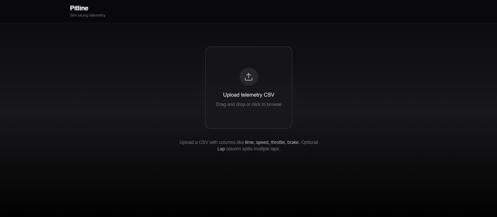
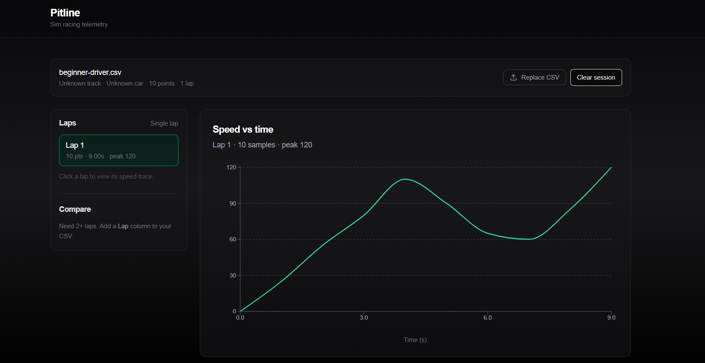
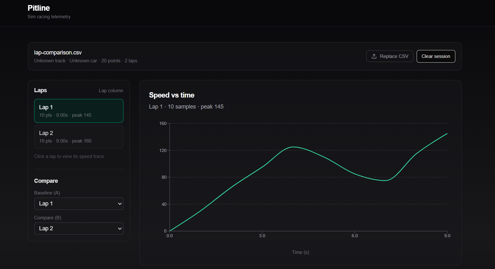
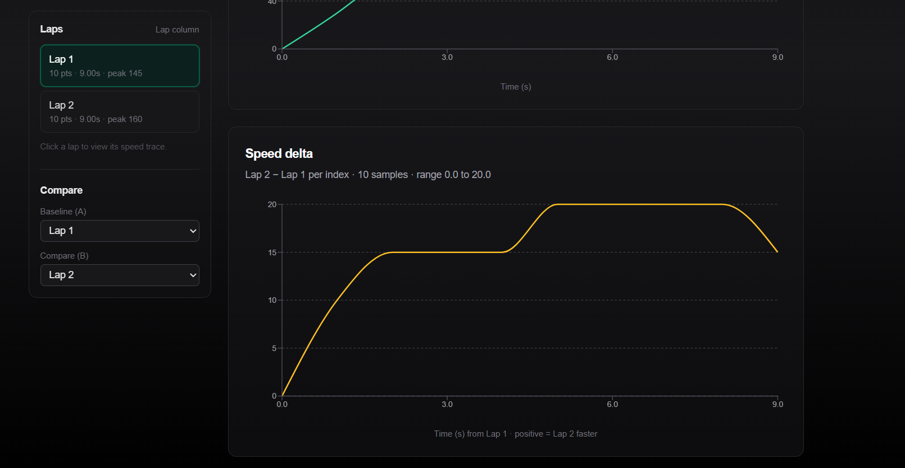

# 🏁 Pitline

### Motorsport Telemetry Analytics Platform for Sim Racers

Transform raw racing telemetry into actionable performance insights.

Pitline helps sim racers upload telemetry data, compare laps, visualize driver inputs, and understand where valuable time is gained or lost on track.

---

## 📸 Screenshots

### 📤 Telemetry Upload



Upload telemetry CSV files and instantly process racing data.

---

### 📊 Telemetry Dashboard



Analyze speed traces, throttle application, braking zones, gear changes, and RPM behavior.

---

### ⚖️ Lap Comparison



Compare multiple laps side-by-side and identify performance differences.

---

### 🧠 Driver Insights



Generate telemetry-based insights to improve consistency and lap times.
pitline-data.vercel.app

---

## 🚀 Project Vision

Pitline turns raw motorsport telemetry into meaningful performance analysis.

Instead of guessing why a lap was slower, drivers can use data to identify weaknesses, compare performance, and make informed improvements.

### Key Benefits

* 📈 Visualize telemetry data instantly
* ⚖️ Compare laps side-by-side
* 🧠 Generate automated driving insights
* 🏁 Identify performance bottlenecks
* 📊 Understand speed, throttle, and braking behavior

---

## 🎯 MVP Features

### 📤 Telemetry Upload

* Upload CSV telemetry files
* Parse racing telemetry data
* Standardize data into a common format

### 📊 Telemetry Visualization

Analyze:

* Speed traces
* Throttle input
* Brake input
* Gear changes
* RPM behavior

### ⚖️ Lap Comparison

* Compare multiple laps
* Calculate performance deltas
* Highlight speed differences
* Identify braking and acceleration variations

### 🧠 Insights Engine

Rule-based analysis to identify:

* Early braking
* Late braking
* Throttle hesitation
* Inconsistent driving behavior
* Corner exit performance issues

---

## 🧱 Core Data Model

All telemetry is normalized into a single structure:

```ts
interface TelemetryPoint {
  time: number;
  x: number;
  y: number;
  speed: number;
  throttle: number;
  brake: number;
  gear: number;
  rpm: number;
}
```

This enables compatibility across multiple racing simulators.

---

## 🏗️ Architecture

```text
CSV Upload
      │
      ▼
Parser Layer
      │
      ▼
Normalization
      │
      ▼
Lap Splitter
      │
      ▼
Analytics Engine
      │
      ▼
Insights Generator
      │
      ▼
UI Visualization
```

Pitline follows a lightweight analytics pipeline architecture designed for performance and extensibility.

---

## 🛠️ Tech Stack

### Frontend

* Next.js (App Router)
* TypeScript
* Tailwind CSS
* shadcn/ui

### Data Visualization

* Recharts

### Backend

* Next.js API Routes

### Storage

* In-Memory Storage (MVP)

Future versions may introduce PostgreSQL and cloud object storage.

---

## 📈 Example Workflow

1. Upload telemetry CSV
2. Parse and normalize telemetry data
3. Split telemetry into laps
4. Select two laps for comparison
5. Analyze speed and driver inputs
6. Generate performance insights

Example insights:

> You are braking too early in Turn 3.

> Better throttle application on the exit of Turn 5.

> Sector 2 is 0.31 seconds slower than your reference lap.

---

## 🧠 Technical Challenges

* Telemetry normalization across simulators
* Lap segmentation and alignment
* Delta calculation between laps
* Interactive telemetry visualization
* Turning raw telemetry into actionable insights

---

## 📁 Project Structure

```text
src/
├── app/
│   ├── upload/
│   ├── dashboard/
│   └── analysis/
│
├── components/
│
├── lib/
│   ├── telemetry/
│   ├── analytics/
│   └── visualization/
│
└── types/
```

---

## 🛣️ Roadmap

### Phase 1 — MVP

* ✅ CSV Upload
* ✅ Telemetry Parsing
* ✅ Lap Visualization
* ✅ Lap Comparison

### Phase 2 — Expansion

* Racing Line Visualization
* Session History
* Sector Analysis
* Leaderboards

### Phase 3 — Advanced Analytics

* AI Coaching Insights
* Setup vs Performance Correlation
* Predictive Lap Analysis
* Driver Performance Tracking

---

## 📌 Status

🚧 Early-stage MVP in active development.

Current focus:

> Build a reliable telemetry analysis pipeline before expanding into advanced racing analytics.

---

## 👨‍💻 Author

**Pranav Swaroop**

Computer Science Student • Full-Stack Developer • AI & Data Systems Enthusiast

---

## ⭐ Project Goal

Pitline was built to demonstrate:

* Full-Stack Engineering
* Data Pipeline Design
* Analytics Systems Development
* Interactive Visualization
* Domain-Specific Software Architecture

A portfolio-grade project focused on motorsport telemetry analysis and performance engineering.
